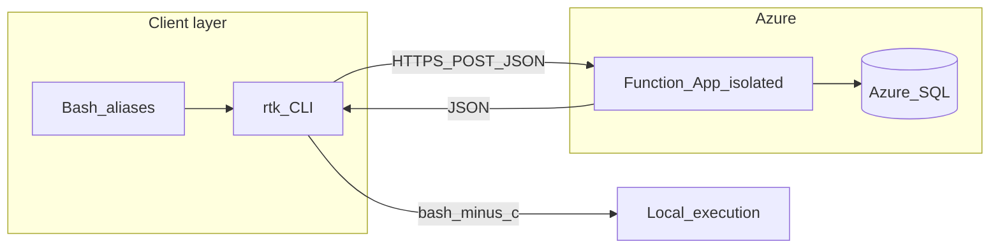

# R2K Orchestration Middleware

<p align="center">
  <strong>Intercept · optimize · execute · measure</strong><br/>
  <sub>Token-aware CLI routing for agents and developers, backed by .NET&nbsp;8 Azure Functions and Azure SQL telemetry.</sub>
</p>

<p align="center">
  <a href="https://dotnet.microsoft.com/download/dotnet/8.0"></a>
  <a href="https://learn.microsoft.com/azure/azure-functions/functions-overview"></a>
  <a href="https://github.com/ChefRod88/rtk-orchestration-middleware/actions/workflows/main_rtk-ochestration-middleware.yml?query=branch%3Amain"></a>
</p>

<details>
<summary><strong>On this page</strong></summary>

- [What this is](#what-this-is)
- [Critical: Function App, not Web App](#critical-use-an-azure-function-app-not-a-web-app)
- [Repository layout](#repository-layout)
- [Prerequisites](#prerequisites)
- [Quick start (local / Codespace)](#quick-start-local--codespace)
- [Configuration reference](#configuration-reference)
- [Database](#database)
- [CI/CD](#cicd)
- [Roadmap](#roadmap)
- [Troubleshooting](#troubleshooting)
- [License](#license)

</details>

---

## What this is

**R2K** sits between your shell (or agent) and everyday tools like `npm`, `git`, and `npx`. A thin **Linux `rtk` binary** forwards the full command string to an **`OptimizeCommand`** HTTP endpoint. The **Azure Function** (isolated worker):

- counts tokens with **Tiktoken** (GPT-family encodings),
- condenses the command string (whitespace + duplicate flags),
- persists **OriginalTokens**, **OptimizedTokens**, **SavingsPercent**, **Command**, and **Timestamp** to **`TokenLogs`** in **Azure SQL** (when configured),
- returns JSON the CLI uses to **run the optimized command** locally and **print savings**.



---

## Critical: use an Azure Function App, not a Web App

> **This repository deploys a .NET 8 *isolated-process* Azure Functions app.**  
> It is **not** an ASP.NET Core web host meant for **`azure/webapps-deploy`** toward a standalone **Web App** with no Functions runtime.

| If you provision… | Result |
|-------------------|--------|
| **Azure Function App** (Consumption, Flex Consumption, Elastic Premium, or Functions-enabled dedicated plan) | Matches the project. CI uses [`Azure/functions-action`](.github/workflows/main_rtk-ochestration-middleware.yml) + `dotnet publish` of [`R2K.Backend`](R2K.Backend/R2K.Backend.csproj). |
| **Azure App Service “Web App”** (generic site, no Functions host) | **Wrong host.** Provision a **Function App** instead, then point workflow **`app-name`** and OIDC/RBAC at that resource. |

**Checklist before first deploy**

1. Azure Portal: **Create resource → Function App** → runtime **.NET**, version aligned with **.NET 8 isolated** worker where offered.
2. **Storage**: host uses **`AzureWebJobsStorage`** per plan requirements.
3. **Application settings**: at minimum **`AzureWebJobsStorage`**, **`FUNCTIONS_WORKER_RUNTIME=dotnet-isolated`**, optional **`SqlConnectionString`**, **`FUNCTIONS_EXTENSION_VERSION`** as required by your plan.
4. **GitHub → Azure**: federated OIDC / secrets must be allowed to deploy to the **Function App** (Contributor / Website Contributor patterns as appropriate—not only an unrelated Web App).

**Repository URL**

GitHub may show a redirect from the legacy name—canonical clone:

```bash
git clone https://github.com/ChefRod88/rtk-orchestration-middleware.git
```

---

## Repository layout

| Path | Role |
|------|------|
| [`R2K.Backend/`](R2K.Backend/) | Isolated-process Azure Function (`OptimizeCommand`), Tiktoken + optimization services, Dapper/SQL. |
| [`R2K.Backend.Tests/`](R2K.Backend.Tests/) | Unit tests (xUnit; **`net9.0`** entry assembly when the tooling host is .NET 9—library under test remains **`net8.0`**). |
| [`R2K.CLI/`](R2K.CLI/) | .NET 8 console app; publish **linux-x64** self-contained single-file → **`rtk`**. |
| [`scripts/install-rtk.sh`](scripts/install-rtk.sh) | Builds CLI and **`sudo install`** to **`/usr/local/bin/rtk`**. |
| [`extras/mcp-stdio-rtk-stub/`](extras/mcp-stdio-rtk-stub/) | Optional **MCP** stdio server (`rtk_invoke` tool); requires **Node/npm** locally. |
| [`R2K.Backend/Schema/TokenLogs.sql`](R2K.Backend/Schema/TokenLogs.sql) | **`TokenLogs`** bootstrap / **`Timestamp`** column patch. |

---

## Prerequisites

- **.NET 8 SDK** for **`R2K.Backend`** and **`R2K.CLI`** (newer SDKs can build **net8.0** target frameworks side by side).
- **Azure Function App** + optionally **Azure SQL** for persisted telemetry.
- **Linux x64** (or compatible glibc environment) for the published **`rtk`** binary.
- **Node.js 18+** only for the MCP stub—not included in the default Dev Container image unless you add a **feature** or install Node manually.

---

## Quick start (local / Codespace)

```bash
git clone https://github.com/ChefRod88/rtk-orchestration-middleware.git
cd rtk-orchestration-middleware
```

**CLI: build + install**

```bash
bash scripts/install-rtk.sh
```

**Environment (required; no embedded production URL)**

Set in **`~/.bashrc`**, shell profile, or **Codespace / GitHub Codespaces secrets → env** injection:

```bash
export RTK_API_URL='https://<YOUR-FUNCTION-APP>.azurewebsites.net/api/OptimizeCommand'
export RTK_FUNCTION_KEY='<function-or-host-key>'   # AuthorizationLevel.Function
```

Reload: **`source ~/.bashrc`** (interactive sessions).

**Optional aliases** (`git` interception can confuse scripts—use `\git` when needed):

```bash
# RTK Automation Hooks
alias npm='rtk npm'
alias git='rtk git'
alias npx='rtk npx'
```

**Function host locally** — add **`local.settings.json`** under **`R2K.Backend/`** mirroring portal values (gitignored):

```bash
cd R2K.Backend && dotnet run
```

Forward **7071** in Codespaces ([`.devcontainer/devcontainer.json`](.devcontainer/devcontainer.json)).

**Tests**

```bash
cd R2K.Backend.Tests && dotnet test
```

**Smoke publish folder** (optional; output is ignored by git):

```bash
dotnet publish R2K.Backend/R2K.Backend.csproj -c Release -o ./func-out
```

The **`func-out/`** directory is listed in **[`.gitignore`](.gitignore)** so it never appears as a tracked artifact.

**MCP stub**

```bash
cd extras/mcp-stdio-rtk-stub && npm install
# Cursor MCP: command "node", args: ["<repo>/extras/mcp-stdio-rtk-stub/server.mjs"]
```

---

## Configuration reference

| Variable | Where | Purpose |
|----------|--------|---------|
| `RTK_API_URL` | CLI env | Full **`https://`** URL to **`OptimizeCommand`**. |
| `RTK_FUNCTION_KEY` | CLI env | Populates **`x-functions-key`** for **`AuthorizationLevel.Function`**. |
| `SqlConnectionString` | Function app settings / `local.settings.json` | Enables **`TokenLogs`** insert + **`SUM`** for session totals. |
| `AzureWebJobsStorage` | Function settings | Azure Functions platform requirement. |
| `FUNCTIONS_WORKER_RUNTIME` | Function settings | **`dotnet-isolated`** for this worker. |

**`local.settings.json`** must stay out of Git—see **[`.gitignore`](.gitignore)**.

---

## Database

Apply [`R2K.Backend/Schema/TokenLogs.sql`](R2K.Backend/Schema/TokenLogs.sql) against **Azure SQL** so **`Timestamp`** exists; the runtime insert uses **`GETDATE()`**.

Without **`SqlConnectionString`**, responses still carry per-request metrics while **`total_session_savings`** reflects no SQL aggregation (**`0`**).

---

## CI/CD

Push **`main`** runs [`.github/workflows/main_rtk-ochestration-middleware.yml`](.github/workflows/main_rtk-ochestration-middleware.yml):

1. **Restore & publish** [`R2K.Backend/R2K.Backend.csproj`](R2K.Backend/R2K.Backend.csproj) with **SDK 8.0.x**.
2. **`Azure/functions-action@v1`** deploys **`func-publish`** artifact to **`app-name: rtk-ochestration-middleware`** — change **`app-name`** to your Function App resource.

---

## Roadmap

Status-style rows first, then forward-looking backlog. Order is directional, not contractual.

### Shipped (baseline)

| ID | Capability |
|----|---------------|
| S1 | .NET **8** isolated **`R2K.Backend`** with HTTP **`OptimizeCommand`**, Tiktoken counts, heuristic CLI rewrite, snake_case JSON for **`R2K.CLI`** compatibility. |
| S2 | **Dapper** + **`Microsoft.Data.SqlClient`** telemetry to **`TokenLogs`** ( **`Timestamp`** ), aggregate session savings **`SUM`**. |
| S3 | **`rtk`** single-file CLI, **`scripts/install-rtk.sh`**, **`RTK_*`** env overrides, optional bash aliases documented. |
| S4 | **GitHub Actions** fixed for **Functions** (**`dotnet publish`** + **`Azure/functions-action`**), not generic Web Apps + .NET **10**. |
| S5 | **xUnit** coverage for tokenizer + optimizer; **`local.settings.json` / `func-out`** git hygiene. |
| S6 | **MCP** reference implementation under **`extras/mcp-stdio-rtk-stub`** (manual **`npm install`**). |

### Now (next 1–2 iterations)

| ID | Focus | Outcome |
|----|--------|---------|
| N1 | Azure alignment | Provision / verify **Function App** (correct plan + **`AzureWebJobsStorage`**); confirm workflow **`app-name`** + RBAC/OIDC deploy succeeds end-to-end. |
| N2 | Secrets ergonomics | Key Vault references or documented rotation for **`SqlConnectionString`** + function keys; align portal settings with **`local.settings.json`** template snippet in wiki/issue. |

### Next (engineering hardening)

| ID | Focus | Outcome |
|----|--------|---------|
| X1 | CLI resilience | Validate **`RTK_API_URL`** nonempty with actionable stderr; graceful HTTP failure messages (status + body excerpt). |
| X2 | CI quality gate | **`dotnet test`** step on **`R2K.Backend.Tests`** in Actions; optional **`dotnet format`** / analyzers gates. |
| X3 | Observability | Application Insights wired to Worker + dependency tracking on SQL failures; **`X-Correlation-Id`** from CLI→Function for log join. |

### Later (platform & product)

| ID | Focus | Outcome |
|----|--------|---------|
| L1 | Declarative infra | IaC (**Bicep** / Terraform) describing Function App + storage + SQL + RBAC + GitHub federated credential. |
| L2 | Data evolution | Indexed **`Timestamp`**, partitioning strategy, archival job; optionally **Flyway**/DbUp migration runner. |
| L3 | MCP productization | **`@scope/mcp-r2k` npm** or bundled container; pinned Cursor **`mcp.json`** recipe **+** troubleshooting runbook. |
| L4 | Policy & scale | Plugin-style optimization rules (**npm**/ **git**/ **pnpm** bundles), quotas / JWT / Managed Identity boundary on **`OptimizeCommand`**, org dashboards. |

---

## Troubleshooting

| Symptom | Likely cause |
|---------|----------------|
| Deploy action fails immediately | **`app-name`** points at non-Function SKU, wrong subscription, or expired OIDC. |
| **`rtk`** fails before HTTP | **`RTK_API_URL`** unset/placeholder; **`source ~/.bashrc`**. |
| **401 / 403** calling Function | Missing/wrong **`RTK_FUNCTION_KEY`** vs **`AuthorizationLevel.Function`**. |
| **`npm` not found** for MCP stub | Install Node/npm or add **`ghcr.io/devcontainers/features/node`** to devcontainer features. |
| **`total_session_savings` stays 0** | Missing **`SqlConnectionString`**, failed insert, firewall, or TLS—check logs. |
| Alias breaks tooling | Bypass with **`command git`** or **`/usr/bin/git`**. |

---

## License

Add a **`LICENSE`** file (MIT, Apache-2.0, etc.) when you finalize distribution terms.

---

<p align="center">
  <sub>Mission&nbsp;2026 — token-aware orchestration without giving up local execution.</sub>
</p>
