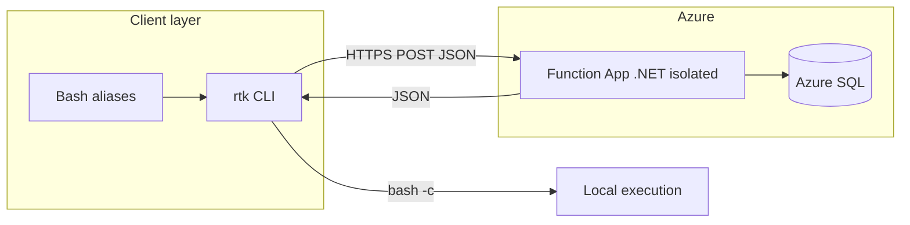

# R2K Orchestration Middleware

<p align="center">
  <strong>Intercept · optimize · execute · measure</strong><br/>
  <sub>Token-aware CLI routing for agents and developers, backed by .NET&nbsp;8 Azure Functions and Azure SQL telemetry.</sub>
</p>

---

## What this is

**R2K** sits between your shell (or agent) and everyday tools like `npm`, `git`, and `npx`. A thin **Linux `rtk` binary** forwards the full command string to an **`OptimizeCommand`** HTTP endpoint. The **Azure Function** (isolated worker):

- counts tokens with **Tiktoken** (GPT-family encodings),
- condenses the command string (whitespace + duplicate flags),
- persists **OriginalTokens**, **OptimizedTokens**, **SavingsPercent**, and **Command** to **`TokenLogs`** in **Azure SQL** (when configured),
- returns JSON the CLI uses to **run the optimized command** locally and **print savings**.



---

## Critical: use an Azure Function App, not a Web App

> **This repository deploys a .NET 8 *isolated-process* Azure Functions app.**  
> It is **not** an ASP.NET Core web host for `webapps-deploy`-style “Web App only” targets.

| If you provision… | Result |
|-------------------|--------|
| **Azure Function App** (Consumption, Flex Consumption, Elastic Premium, or dedicated with Functions runtime) | Matches the project. CI uses [`Azure/functions-action`](.github/workflows/main_rtk-ochestration-middleware.yml) + `dotnet publish` of [`R2K.Backend`](R2K.Backend/R2K.Backend.csproj). |
| **Azure App Service “Web App”** (generic site, no Functions host) | **Wrong host.** Deploy will not map to this worker model; use the Azure portal or CLI to **create a Function App** and point GitHub Actions OIDC + `app-name` at that resource. |

**Checklist before first deploy**

1. In Azure: **Create resource → Function App** (runtime stack **.NET**, version aligned with **net8.0** isolated where offered).
2. Storage account for Functions (queue/timer triggers or host metadata, per plan).
3. Application settings (at minimum **`AzureWebJobsStorage`**, **`FUNCTIONS_WORKER_RUNTIME=dotnet-isolated`**, optional **`SqlConnectionString`**).
4. GitHub Actions: workload identity / OIDC secrets must have permission to deploy to **that Function App** (not only a generic web app RBAC role).

---

## Repository layout

| Path | Role |
|------|------|
| [`R2K.Backend/`](R2K.Backend/) | Isolated-process Azure Function (`OptimizeCommand`), Tiktoken + optimization services, Dapper/SQL. |
| [`R2K.Backend.Tests/`](R2K.Backend.Tests/) | Unit tests (xUnit; test project targets `net9.0` runner where the SDK image only ships the .NET 9 host). |
| [`R2K.CLI/`](R2K.CLI/) | .NET 8 console app—publish as **linux-x64** self-contained single-file → `rtk`. |
| [`scripts/install-rtk.sh`](scripts/install-rtk.sh) | Build + install `rtk` to `/usr/local/bin`. |
| [`extras/mcp-stdio-rtk-stub/`](extras/mcp-stdio-rtk-stub/) | Optional **MCP** stdio bridge (Node.js) exposing tool `rtk_invoke`. |
| [`R2K.Backend/Schema/TokenLogs.sql`](R2K.Backend/Schema/TokenLogs.sql) | SQL bootstrap for `TokenLogs`. |

---

## Prerequisites

- **.NET 8 SDK** (for `R2K.Backend`, `R2K.CLI`; Codespace image may also include newer SDKs—8.0 must be available for publish).
- **Azure Function App** + **Azure SQL** (serverless or provisioned) when you want cloud telemetry.
- **Linux** shell for the published CLI (linux-x64 single-file).
- **Node.js 18+** only if you use the MCP stub.

---

## Quick start (local / Codespace)

```bash
git clone https://github.com/ChefRod88/r2k-orchestration-middleware.git
cd r2k-orchestration-middleware
```

**Build & install the interceptor CLI**

```bash
bash scripts/install-rtk.sh
```

**Point the CLI at your function (required—no baked-in production URL)**

```bash
export RTK_API_URL='https://<YOUR-FUNCTION-APP>.azurewebsites.net/api/OptimizeCommand'
export RTK_FUNCTION_KEY='<function-or-host-key>'   # if the trigger uses AuthorizationLevel.Function
```

**Optional shell interception** (add to `~/.bashrc`; only in interactive shells):

```bash
# RTK Automation Hooks
alias npm='rtk npm'
alias git='rtk git'
alias npx='rtk npx'
```

```bash
source ~/.bashrc
```

**Run the function host locally** (from `R2K.Backend`; create `local.settings.json` from portal settings—file is **gitignored**):

```bash
cd R2K.Backend
dotnet run
```

Forward **7071** in Codespaces ([`devcontainer`](.devcontainer/devcontainer.json)).

**Tests**

```bash
cd R2K.Backend.Tests && dotnet test
```

---

## Configuration reference

| Variable | Where | Purpose |
|----------|--------|---------|
| `RTK_API_URL` | CLI env | Full HTTPS URL to `OptimizeCommand`. |
| `RTK_FUNCTION_KEY` | CLI env | Sends `x-functions-key` for `AuthorizationLevel.Function`. |
| `SqlConnectionString` | Function App settings / `local.settings.json` | Enables Dapper inserts + session `SUM` aggregation. |
| `AzureWebJobsStorage` | Function App settings / `local.settings.json` | Required by Azure Functions host. |
| `FUNCTIONS_WORKER_RUNTIME` | Function App settings | Should be `dotnet-isolated` for this repo. |

Secrets: **`local.settings.json` is listed in [`.gitignore`](.gitignore)**—never commit it.

---

## Database

Run [`R2K.Backend/Schema/TokenLogs.sql`](R2K.Backend/Schema/TokenLogs.sql) against Azure SQL to create or patch **`TokenLogs`** (includes **`Timestamp`**; the app uses **`GETDATE()`** on insert).

If `SqlConnectionString` is unset, the HTTP function still returns optimized JSON and metrics, but **session total** from SQL stays **0** and nothing is written.

---

## CI/CD

On push to **`main`**, [`.github/workflows/main_rtk-ochestration-middleware.yml`](.github/workflows/main_rtk-ochestration-middleware.yml):

1. Restores and **publishes** [`R2K.Backend/R2K.Backend.csproj`](R2K.Backend/R2K.Backend.csproj) with **.NET 8**.
2. Deploys the artifact with **`Azure/functions-action@v1`** to the Function App named **`rtk-ochestration-middleware`** (adjust **`app-name`** to match your Azure resource).

Secrets names in the workflow mirror classic App Service templates; ensure the Azure AD app registration / federated credential is authorized on the **Function App** resource.

---

## Roadmap

Rough priority order—subject to reprioritization.

| Phase | Theme | Items |
|-------|--------|--------|
| **Now** | Deploy hygiene | Confirm Function App SKU + storage; align `app-name` with live Azure; document host key rotation. |
| **Next** | Hardening | CLI: clear errors when `RTK_API_URL` is missing; optional `AZURE_CLIENT_ID`/`DefaultAzureCredential` path for keyless dev. |
| **Next** | Observability | Application Insights + structured logging; correlation id from CLI → Function. |
| **Next** | Data | EF Core migration path *or* Flyway/SQL change scripts for `TokenLogs` indexes (e.g. `Timestamp` DESC). |
| **Later** | Platform | IaC (Bicep/Terraform) for Function App + SQL + RBAC + GitHub OIDC. |
| **Later** | MCP & agents | Ship `mcp-stdio-rtk-stub` with versioned npm release; Cursor `mcp.json` recipe in docs. |
| **Later** | Product | Policy packs (per-tool optimization rules), org-level dashboards, quotas / rate limits on `OptimizeCommand`. |

---

## Troubleshooting

| Symptom | Likely cause |
|---------|----------------|
| Deploy action fails with host mismatch | Target is a **Web App** instead of **Function App**, or wrong `app-name`. |
| CLI 401 from Function | Set `RTK_FUNCTION_KEY` or relax auth in dev (not recommended for production). |
| `total_session_savings` always `0` | `SqlConnectionString` unset, insert failed, or DB unreachable—check Function logs. |
| `git` alias breaks scripts | Use `\git` / `command git` or `/usr/bin/git` when you must bypass `rtk`. |

---

## License

See repository default or add a `LICENSE` file if you want explicit terms.

---

<p align="center">
  <sub>Built for Mission 2026 orchestration—token-smart CLIs without giving up local execution.</sub>
</p>
